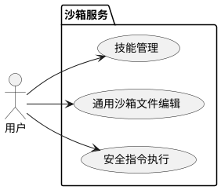
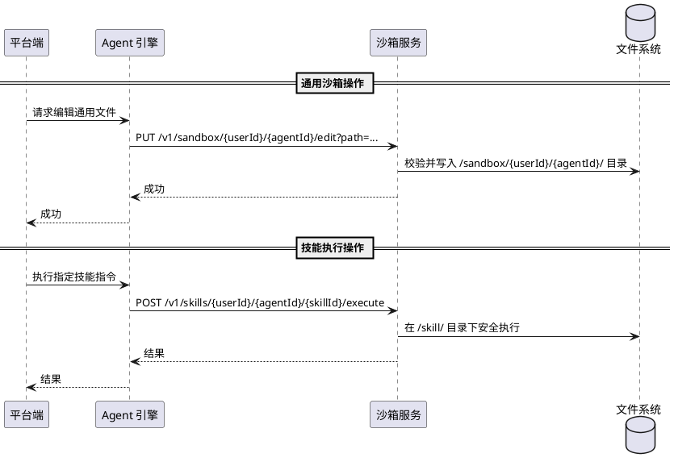
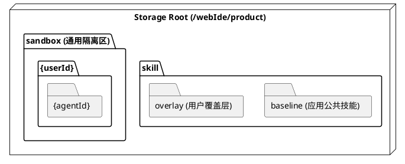

# FileSecBoxService 设计文档

## 1. 整体架构
FileSecBoxService 是一个面向应用开发平台的安全沙箱执行引擎。它采用“分层存储”与“写时复制”技术，实现在 Root 权限容器内逻辑隔离应用公共技能、用户泛化技能以及通用的沙箱临时工作区。

---

## 2. 视图模型

### 2.1 场景视图
描述用户与沙箱服务的核心交互场景。

### 2.2 交互视图
描述平台端、Agent 引擎与沙箱服务的交互协作关系。

### 2.3 物理视图
描述磁盘目录的分层布局。

---

## 3. 核心设计

### 3.1 通用沙箱模块设计
*   **定位**: 提供与特定技能无关的、基于用户和应用隔离的临时文件存储与执行环境。
*   **存储路径**: 强制限制在 `/webIde/product/sandbox/{userId}/{agentId}/`。
*   **功能**:
    *   **文件编辑**: 支持任意路径的创建与局部行替换。
    *   **指令执行**: 工作目录锚定在用户的沙箱根路径，共享 Skill 模块的安全执行逻辑（白名单、环境净化、超时控制）。

### 3.2 Skill 模块设计
*   **存储与分层策略**: 
*   **分层合并逻辑**: 
    1.  **优先级**: 用户覆盖层优先级高于应用公共技能层。
    2.  **列表合并**: 当查询技能列表或文件列表时，沙箱会合并两个目录的结果。若存在同名技能，优先展示 overlay 中的内容。
    3.  **读操作**: 读取文件时，系统首选 overlay 路径，若文件不存在则回退至 baseline 路径。
*   **写时复制**: 
    *   当用户尝试编辑属于 baseline 的文件时，系统会自动在 overlay 的对应目录下创建该文件的物理副本，后续所有修改均作用于副本。
*   **并发控制**: 采用 `ReentrantReadWriteLock` 实现文件级的读写锁，确保在分层合并过程中数据的线程安全。

### 3.2 安全执行引擎
*   **指令白名单**: 严格限制可执行的指令，仅包含以下项：
    `python3`, `pip`, `pip3`, `bash`, `sh`, `ls`, `cat`, `grep`, `sed`, `awk`, `echo`, `cp`, `mv`, `rm`, `mkdir`, `find`, `curl`
*   **路径隔离与锚定**:
    *   **根路径限制**: 指令执行的工作目录强制锚定在当前技能的合并根目录下。
    *   **参数校验**: 对指令参数进行深度扫描。若参数包含绝对路径（以 `/` 开头），必须以当前技能的物理存储路径为前缀；禁止包含 `..` 等路径跳转符。
*   **执行加固**:
    *   **环境净化**: 启动子进程前，强制清理所有以 `KUBERNETES_`, `SERVICE_`, `SECRET_` 开头的环境变量，防止容器环境信息泄露。
    *   **超时控制**: 所有指令执行强制设定 5 分钟超时时间，防止恶意脚本挂起系统资源。
    *   **权限限制**: 虽以 Root 运行，但通过指令白名单和路径锚定将影响范围严格限制在单个技能目录内。

### 3.3 平台映射设计
*   **单表映射**: 云端通过 `agent_skill_registry` 表管理映射关系。
    *   **字段设计**: `id`, `agent_id`, `skill_id`, `user_id` (可为空), `created_at` 等。
    *   **逻辑区分**:
        *   当 `user_id` 为空时，该技能记录属于“应用公共技能”，存储在沙箱的 baseline 目录。
        *   当 `user_id` 不为空时，该记录属于“用户泛化技能”，存储在沙箱的 overlay 目录。

### 3.4 技能生命周期管理
*   **上传与提取**:
    *   **多编码兼容**: 针对上传的 ZIP 包，系统采用“双尝试”机制：首选 UTF-8 解码文件名；若出现 MALFORMED 异常，则自动回退至 GBK 编码重试。
    *   **覆盖逻辑**: 上传同名技能时，系统会执行“删除并重建”策略。先递归删除目标路径下的旧技能文件，再执行解压，确保技能版本的干净覆盖。
*   **元数据解析**:
    *   解压完成后，系统会自动扫描技能根目录下的 `skill.md` 或 `README.md`，提取首行 `#` 标题作为技能的显示名称，若缺失则默认使用目录名。
*   **目录结构强制规范**:
    *   所有提取后的技能必须严格存放于 `/{scope}/{userId}/{agentId}/{skillId}/` 结构下。userId 和 agentId 由 Agent 引擎在调用时通过路径参数传入，沙箱不解析内部逻辑，仅做物理隔离。
