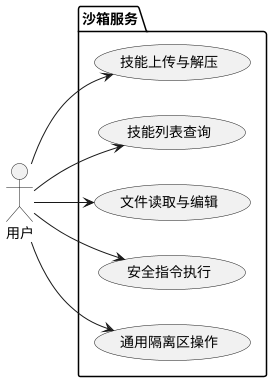
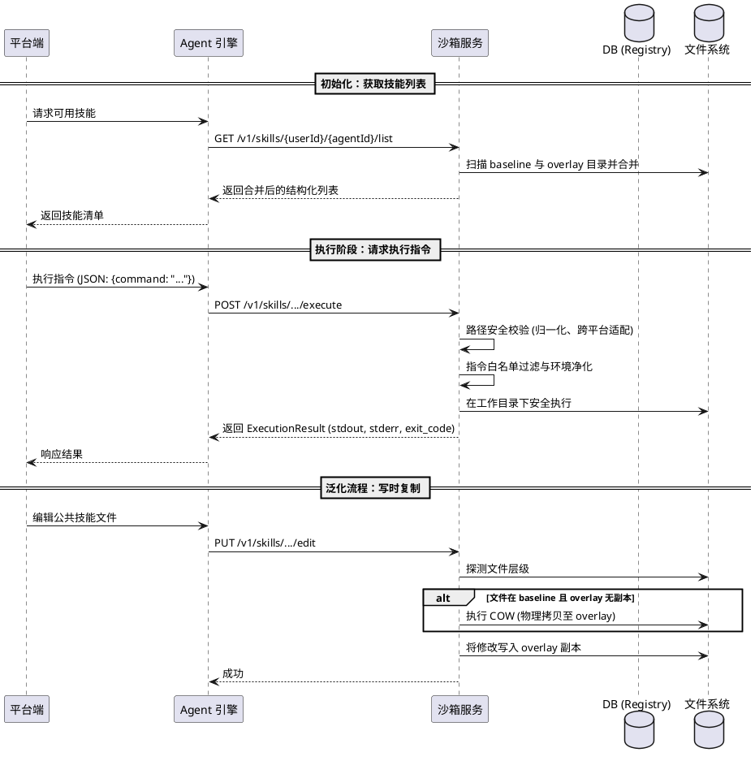
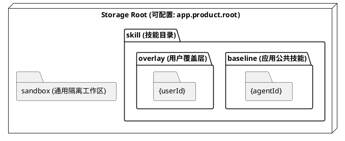

# FileSecBoxService 设计文档

## 1. 整体架构
FileSecBoxService 是一个面向应用开发平台的安全沙箱执行引擎。它采用“分层存储”与“写时复制”技术，实现在 Root 权限容器内逻辑隔离应用公共技能、用户泛化技能以及通用的沙箱临时工作区。

---

## 2. 视图模型

### 2.1 场景视图
描述用户与沙箱服务的核心交互场景。

### 2.2 交互视图
描述平台端、Agent 引擎（SDK）与沙箱服务的交互协作关系。

### 2.3 物理视图
描述磁盘目录的分层布局。

---

## 3. Skill 模块设计

### 3.1 存储与分层策略
*   **分层合并逻辑**: 
    1.  **优先级**: 用户覆盖层 (`overlay`) 优先级高于应用公共技能层 (`baseline`)。
    2.  **查询合并**: 查询列表时，沙箱合并两层目录；若存在同名技能，优先展示 `overlay` 内容。
    3.  **合并读取**: 读取文件时，首选 `overlay` 路径，缺失则回退至 `baseline`。
*   **写时复制 (Copy-on-Write)**: 
    *   当用户编辑属于 `baseline` 的文件时，系统自动在 `overlay` 对应目录下创建该文件的物理副本，后续修改均作用于副本，确保原始基线不被破坏。
*   **线程安全**: 采用 `ReentrantReadWriteLock` 实现按“用户+应用”维度的细粒度锁，确保读写不互斥、读读并发、写写互斥，且读操作在锁释放前完成内存映射（快照读取）。

### 3.2 技能生命周期管理
*   **上传与解压**:
    *   **多编码兼容**: ZIP 包解压支持“双尝试”机制。首选 `UTF-8`；若失败（如 MALFORMED 异常），自动回退至 `GBK` 编码。
    *   **干净覆盖**: 上传同名技能时，采用“先递归删除目标路径、后执行解压”策略，确保技能版本的干净替换。
*   **元数据解析**:
    *   自动扫描技能根目录下的 `SKILL.md`。
    *   支持过滤 YAML 格式分隔符（`---`）。
    *   兼容中英文冒号（`:` 与 `：`）提取 `name` 和 `description` 字段。若缺失则降级使用文件夹名。

### 3.3 安全执行引擎
*   **指令白名单**: 严格限制仅允许以下指令执行：
    `python`, `python3`, `bash`, `sh`, `ls`, `cat`, `echo`, `grep`, `sed`, `mkdir`, `touch`, `cp`, `mv`, `rm`, `tee`, `find`, `chmod`, `xargs`, `curl`
*   **环境变量净化 (Linux 环境)**:
    *   **清理策略**: 删除所有非白名单环境变量。
    *   **保留白名单**: `PATH`, `LANG`, `LC_ALL`, `HOME`, `USER`, `PWD`
    *   **PATH 重置**: 强制设定为 `/usr/local/bin:/usr/bin:/bin`
*   **跨平台路径安全校验**:
    *   **Windows 适配**: 自动识别盘符（如 `D:/`），处理路径分隔符（统一转为 `/`），支持 GBK 编码传输。
    *   **内嵌路径扫描**: 扫描命令行中所有包含绝对路径的部分。若参数包含产品根路径（`app.product.root`），强制要求其物理锚定在当前技能或沙箱工作区内。
    *   **敏感目录拦截**: 
        *   **Linux**: `/etc/`, `/root/`, `/proc/`, `/dev/`, `/sys/`, `/boot/`, `/var/`, `/bin/`, `/usr/bin/`
        *   **Windows**: `c:/windows/`, `c:/users/`, `c:/program files/`, `system32`
*   **执行保障**: 采用异步流读取，独立获取 `stdout` 与 `stderror`，设定 5 分钟硬性超时时间。

---

## 4. 平台端设计

### 4.1 技能注册映射 (Platform Mapping)
*   **单表注册制**: 平台端通过 `agent_skill_registry` 表管理技能归属。
    *   **逻辑判定**:
        *   `userId IS NULL`: 该技能记录属于应用的“基线公共技能”，对应沙箱 `baseline` 目录。
        *   `userId = '真实工号'`: 该技能记录属于用户的“私有泛化技能”，对应沙箱 `overlay` 目录。
*   **冲突视图**: 若同一 `skillId` 同时存在基线与私有记录，前端列表优先展示私有记录并标识为“已泛化”。

---

## 5. 通用沙箱模块设计
*   **定位**: 提供与特定技能无关的临时隔离空间，物理路径为 `${app.product.root}/sandbox/{userId}/{agentId}/`。
*   **功能集**:
    1.  **文件编辑**: 支持创建路径及局部行替换。
    2.  **清单列出**: 递归列出所有文件，路径分隔符统一为 `/`。
    3.  **内容读取**: 支持全量 (String) 或 分页 (List<String>) 的对象化返回。
    4.  **安全执行**: 共享技能模块的安全引擎校验。

---

## 6. 技术实现细节

### 6.1 统一响应模型 (ApiResponse)
所有接口统一返回 JSON 结构：`{"status": "success/error", "data": <T>}`。

### 6.2 执行结果模型 (ExecutionResult)
执行接口返回包含 `stdout`, `stderror`, `exit_code` 的结构化对象。

### 6.3 开发环境要求
*   **JDK**: 1.8
*   **Spring Boot**: 2.3.12.RELEASE
*   **核心库**: Java NIO, Project Lombok, Spring Security
